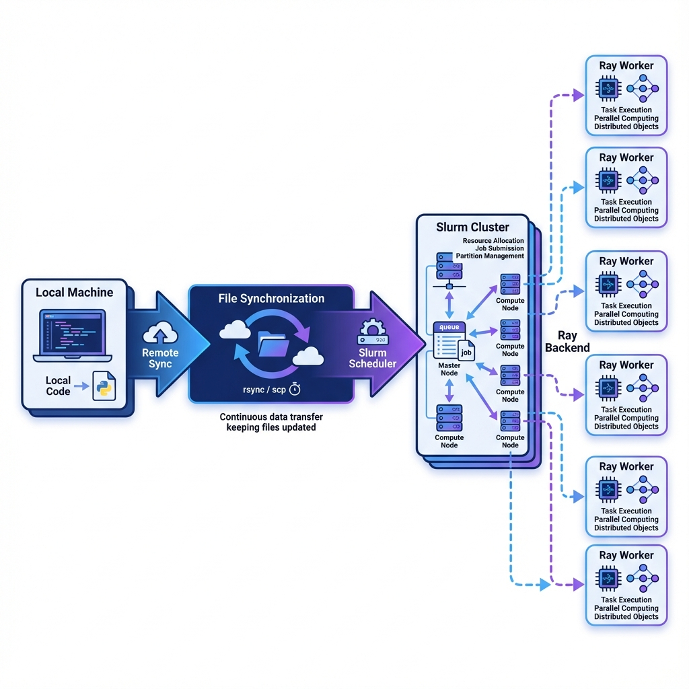

# SlurmRay v6.0.7 - Autonomous Distributed Ray on Slurm

> **The intelligent bridge between your local terminal and High-Performance Computing (HPC) power.**

[](https://www.python.org/)
[](https://opensource.org/licenses/MIT)

SlurmRay allows you to transparently distribute your Python tasks across Slurm clusters (like Curnagl) or standalone servers. It handles environment synchronization, local package detection, and task distribution automatically, turning your local machine into a control center for massive compute resources.

---

## 🚀 The "Local-to-Cluster" Concept



SlurmRay orchestrates the entire lifecycle of a remote task:

1.  **AST-Based Analysis**: It automatically scans the imports in your Python functions to identify which local modules and packages need to be uploaded.
2.  **Incremental Synchronization**: Uses `rsync` to efficiently push only the changed project files to the remote worker.
3.  **Autonomous Ray Bridging**: Automatically allocates Slurm nodes, installs a synchronized virtual environment, and deploys a temporary Ray cluster.
4.  **Transparent Execution**: Runs your local function on the remote cluster using `dill` serialization, returning results directly to your local session.

[**Explore the Interactive Documentation (HTML)**](https://htmlpreview.github.io/?https://github.com/lopilo/SLURM_RAY/blob/master/documentation/index.html)

---

## 🛠 Installation

```bash
pip install slurmray
```

### Prerequisites
*   **Local**: Python 3.9+
*   **Remote**: SSH access to a Slurm cluster or a server with Ray installed.
*   **Recommendation**: Use a `.python-version` file to ensure version consistency.

---

## ⚙️ Configuration

SlurmRay uses a priority-based configuration system. Create a `.env` file in your project root for seamless authentication:

```env
# Credentials for Curnagl or Custom Slurm Clusters
CURNAGL_USERNAME=your_username
CURNAGL_PASSWORD=your_password  # (Optional, will prompt if missing)

# Credentials for Standalone Servers (Desi mode)
DESI_USERNAME=your_username
DESI_PASSWORD=your_password
```

| Parameter | Default | Description |
| :--- | :--- | :--- |
| `project_name` | **Required** | Unique ID for the project logs and remote files. |
| `cluster` | `"curnagl"` | `"curnagl"`, `"desi"`, `"local"`, or a custom IP. |
| `node_nbr` | `1` | Number of nodes to allocate on Slurm. |
| `num_gpus` | `0` | Number of GPUs to request. |
| `memory` | `64` | GB of RAM per node. |
| `max_running_time` | `60` | Max job duration in minutes. |
| `retention_days` | `7` | Days before remote environment cleanup. |
| `force_reinstall_venv` | `False` | Force complete venv reinstallation. |
| `force_reinstall_project` | `False` | Force project files cleanup before upload. |

---

## 📚 Code Examples

### 1. Basic CPU Distribution
Distribute a heavy computation on the Curnagl cluster:

```python
from slurmray import RayLauncher

def heavy_task(n):
    # This code runs on the remote cluster
    return sum(i**2 for i in range(n))

# Initialize the bridge
launcher = RayLauncher(
    project_name="my_research",
    cluster="curnagl",
    node_nbr=2,
    memory=16
)

# Launch and wait for result
result = launcher(heavy_task, args={"n": 10**8})
print(f"Result: {result}")
```

### 2. GPU Accelerated Training
Automatically load CUDA modules and request GPUs:

```python
import torch
from slurmray import RayLauncher

def train_model(epochs):
    device = "cuda" if torch.cuda.is_available() else "cpu"
    # Your PyTorch training logic here...
    return f"Model trained on {device}"

launcher = RayLauncher(
    project_name="deep_learning",
    num_gpus=1,
    node_nbr=1,
    max_running_time=120
)

print(launcher(train_model, args={"epochs": 10}))
```

### 3. Asynchronous Execution & Log Streaming
Don't wait for your job to finish. Monitor it in real-time:

```python
launcher = RayLauncher(
    project_name="long_job",
    asynchronous=True
)

handle = launcher(my_long_function)

print(f"Job ID: {handle.job_id}")

# Stream logs in real-time
for line in handle.logs:
    print(f"[Remote Log] {line}")

# Get result when ready
final_result = handle.result
```

### 4. Intelligent Dependency Detection
SlurmRay automatically detects if your function uses other local modules:

```python
# file: my_utils.py
def helper(): return "Hello from local file!"

# file: main.py
from my_utils import helper
from slurmray import RayLauncher

def main_task():
    return helper() # SlurmRay detects 'my_utils.py' and uploads it automatically!

launcher = RayLauncher(project_name="auto_sync")
print(launcher(main_task))
```

> **New in v7.2**: SlurmRay also auto-detects hardcoded paths to local `.py` files in your code (e.g., inside `subprocess.run(["python", "script.py"])`), preventing remote `FileNotFoundError` without manual configuration.

---

## 🗺 Repository Map

*   `slurmray/`: Core orchestration logic.
    *   `backend/`: Modules for Slurm, Desi, and Local backends.
    *   `scanner.py`: AST scanner for auto-dependency detection.
    *   `file_sync.py`: Incremental `rsync` synchronization logic.
*   `documentation/`: Detailed [HTML Docs](documentation/index.html) and [API Reference](documentation/RayLauncher.md).
*   `tests/`: Comprehensive test suite (CPU, GPU, Multi-node).

---

## 🛤 Roadmap 2026

*   [ ] **Enhanced Caching**: Implement global caching for massive virtual environments.
*   [ ] **Live Dashboard**: Web-based UI for job monitoring and logs.
*   [ ] **Containerization**: Native support for Apptainer/Docker on Slurm.

---

## 👥 Credits & License

SlurmRay is maintained by the **DESI Department @ HEC UNIL**.
Distributed under the **MIT License**.

*Built with ❤️ for researchers who value their time.*
